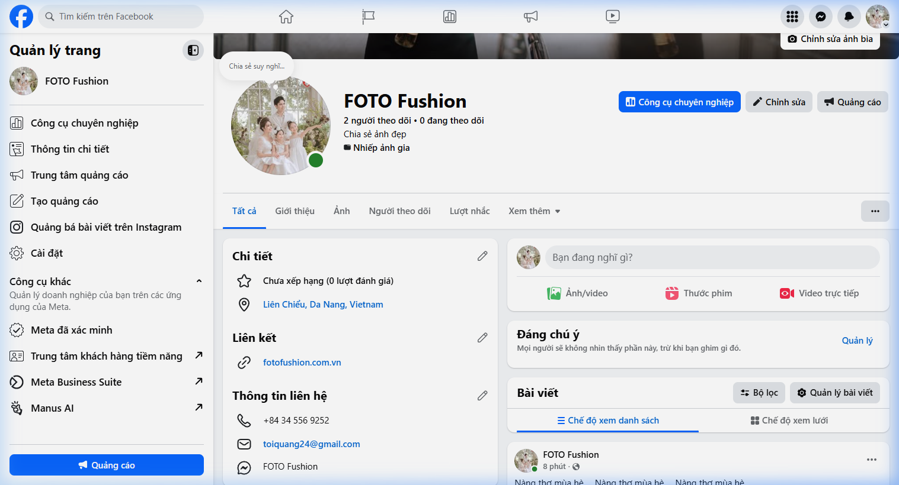
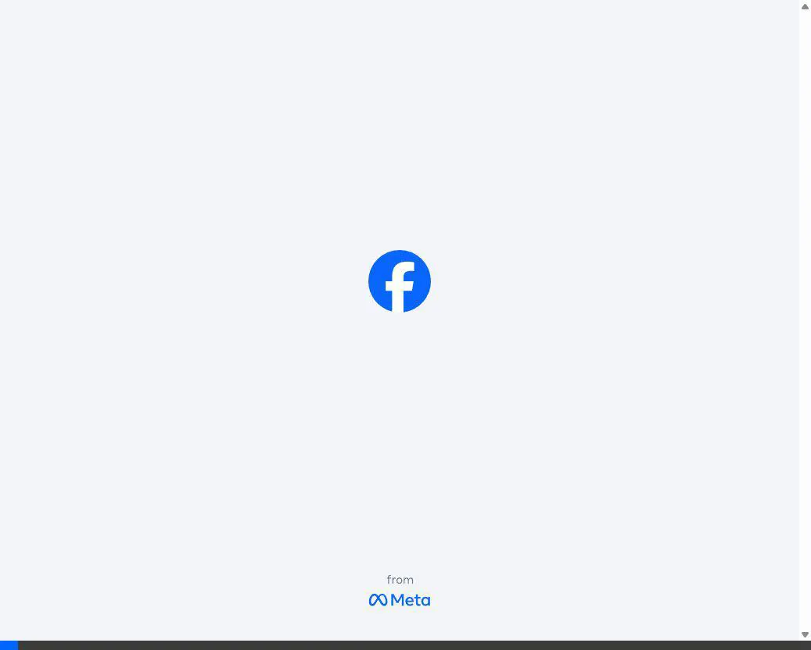
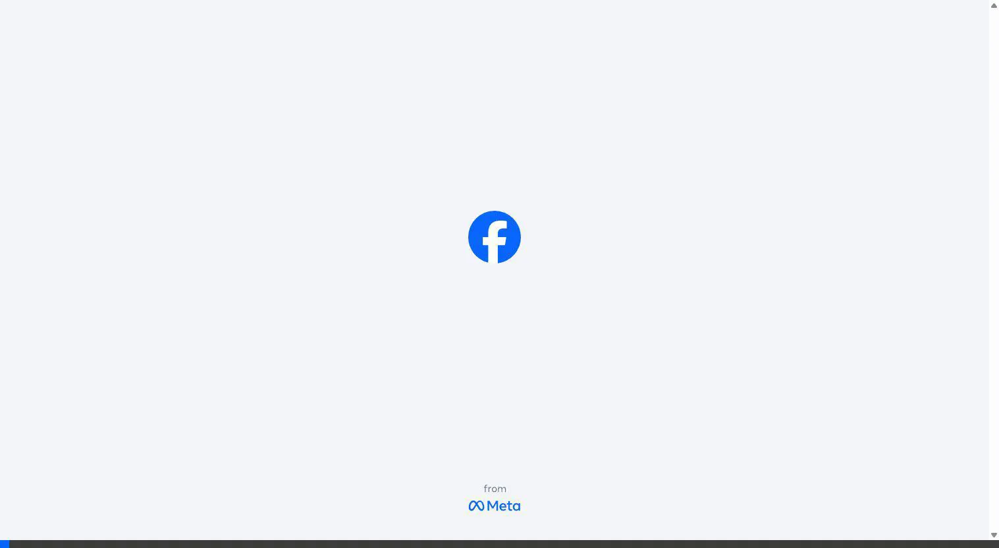
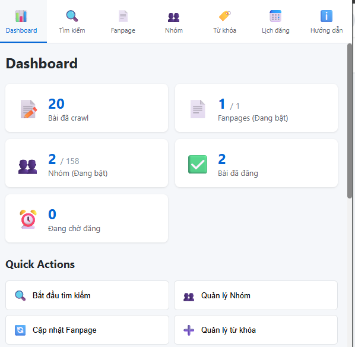
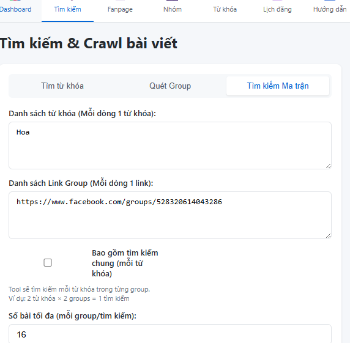

# HƯỚNG DẪN SỬ DỤNG FACEBOOK AUTO MANAGER (PREMIUM)

Chào mừng bạn đến với **Facebook Auto Manager v2.0** - Giải pháp tự động hóa nội dung Facebook chuyên nghiệp. Công cụ giúp bạn thu thập bài viết chất lượng và tự động phân phối lên Fanpage/Group bằng công nghệ API tiên tiến nhất.

---

## 1. Tổng quan Dashboard

Giao diện **Dashboard** là trung tâm kiểm soát toàn bộ hoạt động:
*   **Bài đã crawl**: Tổng số nội dung bạn đã "săn" được từ các nhóm/từ khóa.
*   **Fanpages/Nhóm (Đang bật)**: Các mục tiêu đang trong trạng thái sẵn sàng nhận bài.
*   **Bài đã đăng**: Thành quả thực tế mà tool đã xuất bản.
*   **Quick Actions**: Các nút điều hướng nhanh giúp bạn tiết kiệm thời gian vận hành.

---

## 2. Chiến lược Tìm kiếm Ma trận (Matrix Search)

Đây là tính năng độc quyền giúp bạn "quét sạch" nội dung theo chủ đề:
1.  **Danh sách từ khóa**: Nhập các từ khóa mục tiêu (ví dụ: "Thời trang", "Công nghệ").
2.  **Danh sách Link Group**: Dán các đường dẫn Group Facebook cần lấy bài.
3.  **Bao gồm tìm kiếm chung**: Nếu bật, tool sẽ quét cả bên ngoài các Group đã chỉ định để tìm bài viết chứa từ khóa.
4.  **Số bài tối đa**: Khống chế lượng bài crawl để tối ưu bộ nhớ.

---

## 3. Thiết lập Fanpage & Nhóm mục tiêu

### Quản lý Fanpage

*   **Sync Fanpages**: Nhấn để cập nhật danh sách các Page bạn đang làm quản trị viên.
*   **Khoảng cách đăng (phút)**: Thời gian giãn cách giữa mỗi bài đăng trên Page đó.
*   **Giới hạn bài/ngày**: Chặn số lượng bài tối đa để tránh bị FB "sờ gáy".
*   **Giờ hoạt động**: Đặt khung giờ đăng (VD: 08:00 - 22:00) để bài viết có nhiều tương tác nhất.

### Quản lý Nhóm

*   **Đồng bộ Nhóm**: Lấy toàn bộ danh sách hàng trăm nhóm bạn đã tham gia chỉ với 1 cú click.
*   **Bật/Tắt**: Chỉ chọn đăng vào những nhóm chất lượng, không bị kiểm duyệt gắt gao.

---

## 4. Lên lịch thông minh (Smart Scheduler)

Quy trình tự động hóa tuyệt đối:
*   **Bước 1**: Chọn các bài viết tâm đắc từ kho bài đã crawl.
*   **Bước 2**: Chọn đối tượng đăng (Fanpage hoặc Nhóm).
*   **Bước 3**: Nhấn **Lưu**, Extension sẽ tự động "thủ vai" tài khoản của bạn để đăng bài theo đúng lịch trình đã định.

---

## 5. Tính năng độc quyền: Cơ chế Tự học API

> [!IMPORTANT]
> **Self-Learning API Sniffer**: Đây là công nghệ giúp Extension "miễn nhiễm" với các thay đổi của Facebook. Hệ thống sẽ tự động học các mẫu cấu trúc API mới nhất mỗi khi có bài đăng thành công.

> [!TIP]
> **Smart Context Switch**: Khi đăng vào Fanpage, nếu bạn đang ở trang cá nhân, công cụ sẽ tự động kích hoạt tính năng "Chuyển Quyền" (Switch Profile) và bám đuổi để đảm bảo bài viết được đăng đúng tư cách là Page.

---
*Mọi thắc mắc vui lòng liên hệ bộ phận hỗ trợ kỹ thuật!*
